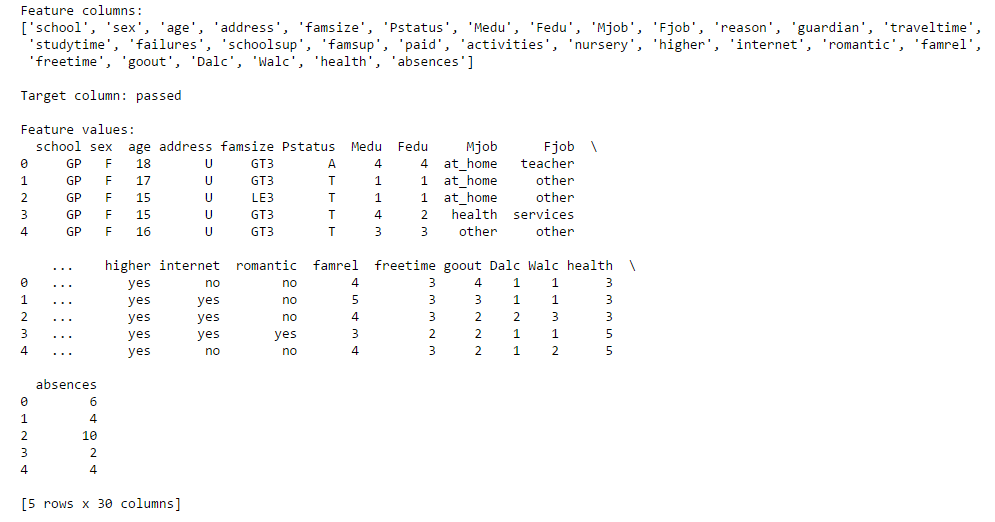
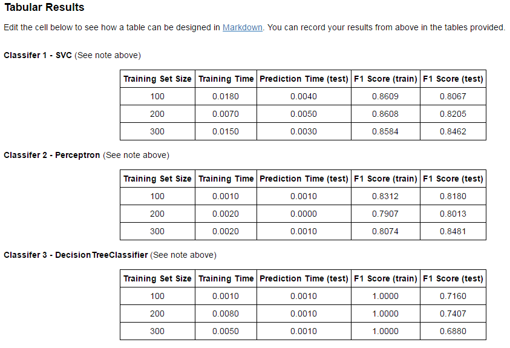

# Student_Intervention
This repository contains project files for the ‘Student Intervention’ project as part of Udacity's Machine Learning Nanodegree. The project can be viewed by opening 'student_intervention.html' in a web browser, or can be run interactively by opening 'student_intervention.ipynb' in a Jupyter Notebook. 

**Note** This project is no longer included in the Nanodegree program, but all final project files have been graded and approved by Udacity.

In this project, I examine a dataset containing data for 395 students enrolled in particular college or university. The data for each student includes 30 different features. I then explore several different Machine Learning classifiers to predict which students are at risk of failing to graduate on time, based on their features. The final tuned model reaches a prediction accuracy of 86%. A college or university may use this kind of technology to help at-risk students get back on track to graduate before it is too late. 

Starter files provided by Udacity are in the 'Student Intervention Starter Files' folder. 

## Screenshots
Below are a few screenshots showing features of this project.

## Installation
The installation documentation for the Jupyter platform can be found [here](https://jupyter.readthedocs.io/en/latest/install.html).
The documentation for advanced usage of Jupyter notebook can be found
[here](https://jupyter-notebook.readthedocs.io/en/latest/).

This project requires **Python 2.7** and the following Python libraries installed:

- [NumPy](http://www.numpy.org/)
- [Pandas](http://pandas.pydata.org)
- [matplotlib](http://matplotlib.org/)
- [scikit-learn](http://scikit-learn.org/stable/)

## Usage - Running Jupyter notebook

### Running in a local installation

Launch with:

    $ jupyter notebook
